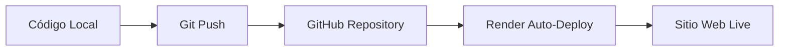

# 🌐 Sitio Web Personal - Gaspar Alfredo Gijon Gil

## 📋 Descripción
Sitio web personal completo y moderno con funcionalidades interactivas, diseño responsive y sistema avanzado de gestión de cookies.

## ✨ Características

### 🏠 Páginas Principales
- **Inicio** - Página principal con herramientas interactivas
- **Quién Soy** - curriculum vitae con editor de texto en tiempo real
- **Galería** - Multimedia con imágenes, videos y audio
- **Contacto** - Formulario completo con validación
- **Política de Privacidad** - Gestión transparente de datos

### ⚙️ Funcionalidades Interactivas
1. **Conversor de Divisas** - USD/EUR/MXN con tasas actualizadas
2. **Quiz Interactivo** - Cuestionario sobre desarrollo web
3. **Editor de Texto** - Formato en tiempo real para biografía
4. **Sistema de Cookies** - Gestión avanzada con 4 tipos de cookies
5. **Reloj en Tiempo Real** - Fecha y hora actualizada
6. **Tema Claro/Oscuro** - Personalización visual
7. **Barra de Progreso** - Indicador de scroll
8. **Menú Responsive** - Navegación adaptable

### 📱 Diseño Responsive
- **Móviles:** < 768px
- **Tablets:** 768px - 1024px  
- **Desktop:** > 1024px

## 📁 Estructura del Proyecto
```
sitioweb/
├── index.html                  # Página principal
├── autobiografia.html          # Biografía personal
├── galeria.html               # Galería multimedia
├── contacto.html              # Formulario de contacto
├── politica-privacidad.html   # Política de privacidad
├── test-funcionamiento.html   # Página de pruebas
├── css/
│   └── style.css              # Estilos únicos y variables CSS
├── js/
│   └── script.js              # JavaScript con todas las funcionalidades
├── multimedia/
│   ├── 1.jpeg, 2.jpeg, 3.jpeg, 4.jpeg
│   ├── logo.png, ABCUENTOS.png
│   ├── furelise.mp3           # Audio de ejemplo
│   └── universo.mp4           # Video de ejemplo
├── README_COOKIES.md          # Documentación de cookies
├── REPORTE_REVISION_SITIO.md  # Reporte completo de revisión
└── README.md                  # Este archivo
```

## 🚀 Instalación y Uso

### ✅ Nuevo módulo: Gestión de usuarios (PHP + MySQL/MariaDB)

Se añadió un módulo completo para la gestión de usuarios usando PHP y MySQL/MariaDB. Está pensado para desarrollarse y probarse localmente con XAMPP (o cualquier stack LAMP) y también para desplegarse en Render como Web Service usando Docker.

Archivos añadidos:
- `api/` - Endpoints PHP: `db.php`, `register.php`, `login.php`, `list.php`, `update.php`, `delete.php`, `check_session.php`, `logout.php`, `save_contact.php`
- `users.html` - Interfaz administrativa (frontend) con validaciones JS
- `js/users.js` - Lógica de fetch y validación (contraseña/re-contraseña)
- `css/users.css` - Estilos para la interfaz de usuarios
- `css/login-modal.css` - Estilos neumórficos para el modal de login
- `users.sql` - Script SQL para crear la base de datos, tablas `users` y `contactos`
- `Dockerfile` - Contenedor Apache+PHP para desplegar como Web Service en Render

### 🔑 Modal de Login Neumórfico

Se integró un **modal de login con diseño neumórfico** accesible desde el menú de navegación en todas las páginas del sitio:

**Características:**
- ✨ Diseño neumórfico moderno (sombras internas/externas)
- 🎨 Integración con Boxicons para íconos
- 📱 Responsive (móvil, tablet, desktop)
- 🔒 Conexión directa con `api/login.php`
- ✅ Validación de sesión en tiempo real
- 🚪 Redirección automática al panel de administración tras login exitoso

**Ubicación:** Botón "Iniciar Sesión" en el nav de todas las páginas (`index.html`, `autobiografia.html`, `galeria.html`, `contacto.html`)

### 📨 Formulario de Contacto con Base de Datos

El formulario de contacto ahora guarda los mensajes directamente en la base de datos MySQL:

**Endpoint:** `api/save_contact.php`  
**Tabla:** `contactos` (incluida en `users.sql`)  
**Campos guardados:**
- Nombre, email, teléfono
- Género, preferencias de contacto
- Asunto y mensaje
- Fecha de creación (timestamp)

**Funcionalidad:**
- ✅ Envío asíncrono vía fetch (sin recargar página)
- ✅ Validación de campos obligatorios
- ✅ Mensajes de éxito/error en tiempo real
- ✅ Integración con sistema de cookies (autoguardado si está habilitado)

### 📌 Requisitos locales (XAMPP / MariaDB / MySQL)

1. Instala XAMPP o tu stack preferido.
2. Importa `users.sql` en phpMyAdmin o usando la consola MySQL:

```bash
mysql -u root -p < users.sql
```

3. Copia los archivos a la carpeta pública de tu servidor (por ejemplo `htdocs/sitioweb`).
4. Asegúrate de configurar la conexión de BD en `api/db.php` o mediante variables de entorno (en local puedes dejar `DB_USER=root`, `DB_PASS=` si usas XAMPP):

```php
// api/db.php lee estas variables de entorno por defecto
DB_HOST=127.0.0.1
DB_NAME=personal_site
DB_USER=root
DB_PASS=
DB_PORT=3306
```

5. Abrir en el navegador `http://localhost/sitioweb/users.html` para probar el registro, login y CRUD de usuarios.

### ☁️ Despliegue en Render (Web Service con Docker)

Render no provee MySQL gestionado en todos los planes; por ello debes usar una base de datos MySQL externa (por ejemplo PlanetScale, ClearDB o cualquier proveedor MySQL remoto). Recomendación gratuita: PlanetScale (MySQL-compatible).

Pasos resumidos:
1. Subir el repo a GitHub (ya está en `CREARPRO/personal-site`).
2. Crear la base de datos en el proveedor MySQL y obtener host, usuario, contraseña y puerto.
3. En Render crear un nuevo **Web Service** usando tu repo y seleccionar **Docker** (Render detectará `Dockerfile`).
4. En la configuración de Service, añade las variables de entorno en Render:

```
DB_HOST=tu_host_mysql
DB_NAME=personal_site
DB_USER=tu_usuario
DB_PASS=tu_password
DB_PORT=3306
```

5. Build Command: (no es necesario con Dockerfile)
6. Start Command: (no es necesario con Dockerfile)
7. Deploy. El contenedor ejecutará Apache+PHP y las rutas `api/*.php` estarán accesibles.

### 🔐 Seguridad y notas
- Nunca pongas credenciales en el repo. Usa variables de entorno en Render.
- Cambia el valor de `DB_PASS` y utiliza contraseñas seguras en producción.
- Las contraseñas se almacenan con `password_hash()` y el login usa `password_verify()`.

### ✅ Verificar funcionalidad en línea

1. Crea la BD y ejecuta `users.sql` en tu servicio MySQL remoto (PlanetScale o similar).
2. Asegúrate de que las variables de entorno en Render apunten a esa BD.
3. Accede a `https://<tu-servicio>.onrender.com/users.html` y prueba: registrar, iniciar sesión, editar y eliminar usuarios.

### 🌐 Hosting con Render (Método Utilizado)

Este proyecto está alojado en **Render**, una plataforma moderna de hosting que ofrece despliegue gratuito y automático desde repositorios de GitHub.

#### ✨ ¿Por qué Render fue elegido para este proyecto?

**Render** es ideal para este sitio web porque:
- ✅ **Gratuito** - Plan free perfecto para sitios personales
- ✅ **Despliegue automático** - Se actualiza automáticamente con cada push a GitHub
- ✅ **HTTPS gratuito** - SSL incluido sin configuración adicional
- ✅ **CDN global** - Carga rápida en todo el mundo
- ✅ **Compatible con sitios estáticos** - Perfecto para HTML, CSS y JavaScript
- ✅ **Sin servidor requerido** - Ideal para frontend puro
- ✅ **Integración GitHub** - Conexión directa con el repositorio

#### 🎯 Funcionalidades del Sitio que Justifican Render

**Estilos CSS avanzados:**
- Variables CSS customizables
- Diseño responsive (móvil, tablet, desktop)
- Tema claro/oscuro dinámico
- Animaciones y transiciones suaves
- Sistema de grid moderno

**JavaScript interactivo:**
- Conversor de divisas en tiempo real
- Quiz interactivo con validación
- Editor de texto con formato
- Sistema de cookies RGPD
- Reloj en tiempo real
- Barra de progreso de scroll

### 📋 Instrucciones de Instalación

#### Método 1: Sitio Estático (Recomendado - Gratuito)

1. **Crear repositorio en GitHub:**
   ```bash
   git init
   git add .
   git commit -m "Initial commit: Personal website"
   git remote add origin https://github.com/TU-USUARIO/personal-site.git
   git push -u origin main
   ```

2. **Conectar con Render:**
   - Ve a [render.com](https://render.com)
   - Crea cuenta gratuita
   - Selecciona **"Static Site"**
   - Conecta tu repositorio de GitHub
   - Configura:
     - **Build Command:** (vacío)
     - **Publish Directory:** `.`
   - ¡Deploy automático!

#### Método 2: Web Service con Node.js (Alternativo - Gratuito)

Si prefieres usar Web Service (más flexible para futuras expansiones):

1. **El proyecto ya incluye:**
   - `package.json` - Configuración de Node.js
   - `server.js` - Servidor Express básico
   - `Procfile` - Configuración de despliegue

2. **Configuración en Render:**
   - Selecciona **"Web Service"**
   - Language: **Node.js**
   - Build Command: `npm install`
   - Start Command: `npm start`
   - Auto-Deploy: **Yes**

#### 🔄 Flujo de Trabajo



### 🌟 Ventajas del Hosting Elegido

**Render vs Otras Opciones:**

| Característica | Render | GitHub Pages | Netlify | Vercel |
|---------------|--------|-------------|---------|--------|
| Gratuito | ✅ | ✅ | ✅ | ✅ |
| HTTPS | ✅ | ✅ | ✅ | ✅ |
| Auto-deploy | ✅ | ✅ | ✅ | ✅ |
| Node.js Support | ✅ | ❌ | ✅ | ✅ |
| Fácil setup | ✅ | ✅ | ✅ | ✅ |
| CDN Global | ✅ | ✅ | ✅ | ✅ |

### 🎯 Opciones de Despliegue

#### A) Sitio Estático (Más Simple)
- **Ideal para:** HTML, CSS, JS puro
- **Ventajas:** Más rápido, menos recursos
- **Uso:** Frontend únicamente

#### B) Web Service (Más Flexible)  
- **Ideal para:** Proyectos que pueden crecer
- **Ventajas:** Soporte para backend futuro
- **Uso:** Full-stack potential

### 🚀 URL del Sitio en Vivo
Una vez desplegado, tu sitio estará disponible en:
```
https://personal-site-[hash].onrender.com
```

**Ambas opciones son completamente gratuitas** y perfectas para sitios web personales con todas las funcionalidades implementadas.

## 🔧 Personalización

### Cambiar Colores (CSS Variables)
```css
:root {
    --color-primary: #0066CC;      /* Azul principal */
    --color-secondary: #EEFF00;    /* Amarillo secundario */
    --color-accent: #1CBAD6;       /* Azul claro */
    --color-bg: #6557e4;           /* Fondo morado */
}
```

### Modificar Tasas de Cambio
```javascript
// En js/script.js - función convertCurrency()
const rates = {
    'USD_MXN': 17.50,  // Actualizar según tasas reales
    'EUR_MXN': 19.20,
    // ... más tasas
};
```

### Agregar Preguntas al Quiz
```javascript
// En js/script.js - variables del quiz
let correctAnswers = { 
    'a': 'c',  // JavaScript
    'b': 'b',  // CSS
    'c': 'c',  // React
    'd': 'a'   // Nueva pregunta
};
```

## 📊 Funcionalidades Backend (Opcional)

### Formulario de Contacto
Para habilitar el envío real de emails, crear `procesa.php`:
```php
<?php
if ($_POST) {
    $nombre = $_POST['nombre'];
    $email = $_POST['email'];
    $mensaje = $_POST['mensaje'];
    
    // Procesar y enviar email
    mail('tu@email.com', 'Contacto Web', $mensaje);
    echo 'Mensaje enviado correctamente';
}
?>
```

### Base de Datos (Opcional)
Para persistir preferencias de usuario:
- MySQL/PostgreSQL para datos estructurados
- MongoDB para datos JSON
- Firebase para solución cloud

## 🔒 Seguridad y Privacidad

### Cookies Implementadas
1. **Esenciales** - Funcionamiento básico (siempre activas)
2. **Análisis** - Estadísticas de uso (opcional)
3. **Personalización** - Temas y preferencias (opcional)
4. **Funcionalidad** - Autoguardado de formularios (opcional)

### Cumplimiento RGPD
- ✅ Banner informativo
- ✅ Consentimiento granular
- ✅ Política de privacidad completa
- ✅ Derecho al olvido
- ✅ Gestión transparente

## 📈 Optimización de Rendimiento

### Métricas Objetivo
- **First Contentful Paint:** < 1.5s
- **Largest Contentful Paint:** < 2.5s
- **Cumulative Layout Shift:** < 0.1
- **First Input Delay:** < 100ms

### Optimizaciones Aplicadas
- ✅ CSS optimizado con variables
- ✅ JavaScript modular
- ✅ Imágenes en formato adecuado
- ✅ Carga diferida de scripts
- ✅ Responsive design eficiente

## 🐛 Solución de Problemas

### Cookies No Funcionan
- Verificar que el sitio use HTTPS
- Comprobar que no esté en localhost (usar 127.0.0.1)
- Verificar configuración del navegador

### Formulario No Envía
- Implementar backend PHP/Node.js
- Configurar servidor de email
- Verificar permisos de archivos

### Estilos No Cargan
- Verificar rutas relativas
- Comprobar permisos de archivos
- Revisar configuración del servidor

## 📞 Soporte
- **Email:** gijongaspar31@gmail.com
- **Ubicación:** Tizimín, Yucatán, México

## 📄 Licencia
© 2025 Gaspar Alfredo Gijon Gil. Todos los derechos reservados.

---
**🎉 ¡El sitio está listo para ser usado en producción!**